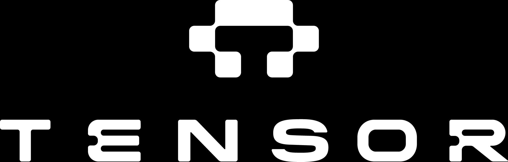

  

# OpenTau - Train VLA models with full $\pi$ techniques

The $\pi$ series policies are by far the most popular models in today's VLA community.
While many training techniques have been described in the $\pi$ papers, only a small fraction of these techniques have been implemented in open-source repositories.
Whether you use the official OpenPi codebase or LeRobot's reimplementation, you are missing out on a lot of the key components that make the $\pi$ models perform so well, including:

- Co-training on an adjustable mixture of heterogeneous datasets
- Discrete actions for fast VLM convergence in $\pi_{0.5}$
- Knowledge insulation between the VLM backbone and the action expert
- Dropout layers in the VLM that prevent overfitting
- Reinforcement learning pipeline described in $\pi^*_{0.6}$
- And more...

OpenTau ($\tau$) is a tool developed by *[Tensor](https://www.tensor.auto)* to bridge this gap. We want to help everyone train VLAs on their own datasets while fully leveraging the key techniques that make the $\pi$ models so powerful.

|                                                 Features |          OpenPi           |             LeRobot              | **OpenTau** |
|---------------------------------------------------------:|:-------------------------:|:--------------------------------:|:-----------:|
|                  Co-training with Heterogeneous Datasets |             ❌             |                ❌                 |      ✅      |
|                  Discrete Actions Training in $\pi_{0.5}$|             ❌             |                ❌                 |      ✅      |
| Knowledge Insulation (KI) between VLM and Action Decoder |             ❌             |                ❌                 |      ✅      |
|                              Dropout Layers in PaliGemma | ✅ (Jax)  ❌ (PyTorch) |                ❌                 |      ✅      |
|                        Multi-Node and Multi-GPU Training |             ❌             |                ✅                 |      ✅      |
|                 Fully Functioning $\pi_{0.5}$ Checkpoint |             ✅             | ❌   (Missing Text Embeddings) |      ✅      |
|            Simulation Environments for Evaluating Models |             ❌             |                ✅                 |      ✅      |
|    $\pi^{*}_{0.6}$ style Reinforcement Learning Pipeline |             ❌             |                ❌                 |      ✅      |
|                                                Framework |       Jax / PyTorch       |             PyTorch              |   PyTorch   |

## Quick Start
If you are familiar with LeRobot, getting started with OpenTau is very easy.
Because OpenTau is a fork of the popular LeRobot repository, any LeRobot-compliant policy and dataset can be used directly with OpenTau.
Check out our documentation to get started quickly.

## Checkpoints
We provide fully functioning $\pi_{0.5}$ checkpoints trained on the LIBERO dataset with high success rates.

| Model Checkpoint                                                            | Description                                                                                              | Success Rate (%)                                                   |
|-----------------------------------------------------------------------------|----------------------------------------------------------------------------------------------------------|--------------------------------------------------------------------|
| [TensorAuto/tPi0.5-libero](https://huggingface.co/TensorAuto/tPi0.5-libero) | A $\pi_{0.5}$ model checkpoint trained on the LIBERO dataset with discrete actions and knowledge insulation. | 98.4% (10)   97.6% (Goal)   100% (Object)   98% (Spatial) |
| More coming soon...                                                         |                                                                                                          |                                                                    |

## Acknowledgements
We would like to thank the original authors of the $\pi$ series [papers](https://www.pi.website/blog) for their groundbreaking work in the VLA field.
We also acknowledge the contributions of the open-source community, especially [LeRobot](https://huggingface.co/lerobot), for their efforts in re-implementing the $\pi$ models and standardizing training infrastructure.
OpenTau builds upon these foundations to provide a more accessible and comprehensive tool for training vision-language agents.
